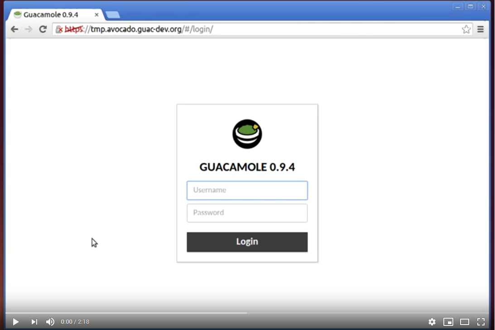

# K8S Guacamole


Apache Guacamole is a clientless HTML5 web based remote desktop gateway that makes it easy to access remote servers and desktops through a web browser. It supports standard protocols like VNC, RDP, and SSH.

In this repository, we are going to learn how to setup Guacamole web-based remote desktop access tool on Kubernetes server.

Kubernetes is fast developing and this deployment will target `kubernetes 1.16.x`.

You can see below a simple demo of Guacamole :

[](https://youtu.be/AjuHJHtd4zU)

## Image Usage

Images are fetched from Docker's image repo:

Guacamole: 1.1.0

* https://hub.docker.com/u/guacamole - Base

* https://hub.docker.com/r/guacamole/guacamole  - guacamole/guacamole:1.1.0
* https://hub.docker.com/r/guacamole/guacd  - guacamole/guacd:1.1.0

MariaDB (MySQL Clone): 10.5.3

* https://hub.docker.com/_/mariadb/ - mariadb:10.5.3

InitContainer - Data Onramp : 1.1.0

* https://hub.docker.com/r/d2iqshadowbq/guacd-helper/tags d2iqshadowbq/guacd-helper:1.1.0

## Install on D2iQ Konvoy

https://d2iq.com/solutions/ksphere/konvoy#request-free-trial

Enable you cluster: `konvoy up -y`

### Install

`kubectl apply -f manifests`

Example: https://a39306ab925214a18bbedd2ded635581-1473587611.us-east-1.elb.amazonaws.com/guacamole/guacamole/#/

## Automatic Initializing the MySQL database

The initcontainer on `guacamole-app` automatically applies the standard schema, and default user `guacadmin`.

## Troubleshooting & Spiking Data

You can deploy pod  `manifest/90-guacd-helper-pod.yaml` which you can use to sql into the backend if needed.


```bash
$> kubectl exec -it guacamole-helper --namespace guacamole -- /bin/sh
container $>  $$PROFIT$$
```
